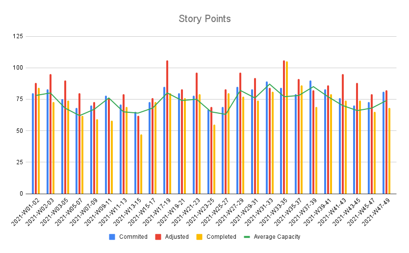

# Jira Metrics Sync

This is a small experiment to compare different Sprints from the Sprint Report included in JIRA.


The Sprint Report in JIRA contains a detailed account for the metrics of a specific Sprint but it doesn't provide a mechanism to compare the metrics over time. This script attempts to solve that problem, extracting the report of each close Sprint, compiling statistics (as completed story points, change of scope, etc) and storing them on a GoogleSheet for further comparison.



# How to use it

## Configuration

A couple of files are needed in the root of the project of path of the executable binary:

* A Google API project has been created in order to store the information in a designated GoogleSheet. Thus, a file named `credentials.json` is needed and [it contains the necessary secrets](https://developers.google.com/workspace/guides/create-credentials#desktop) to access the GoogleSheet from the script.

* A second file named `.jira-metrics.yaml` needs to be set and contains environment variables as API credentials for accessing JIRA API and other details like the destination GoogleSheet ID.

### Additional info

* [Google Sheet Template](https://docs.google.com/spreadsheets/d/19ctuMAb1sdAcWgfmOzZZYsob_pdpP-wH9wgojOqhDgs/edit#gid=140024541)

## Execution

After closing an Sprint, run the script as follows:

For choosing and syncing one specific Sprint:
```bash
jira-metrics sync --year 2021
```

For choosing and syncing ALL Sprints of the year (only run this if the GoogleSheet is empty to avoid duplicates):
```bash
jira-metrics sync --year 2021 --all
```

> The Sprints needs to be closed because there is a filter for this condition. Moreover, the restimations of tickets are based on the adjustments done while the tickets were still on the selected Sprint before closing.

# TODO

- [ ] Read all configuration from the same env variables or file.
- [ ] Check all configuration in the beginning of the command instead of calling viper in separate functions.
- [ ] Add a parameter for syncing a known Sprint.
